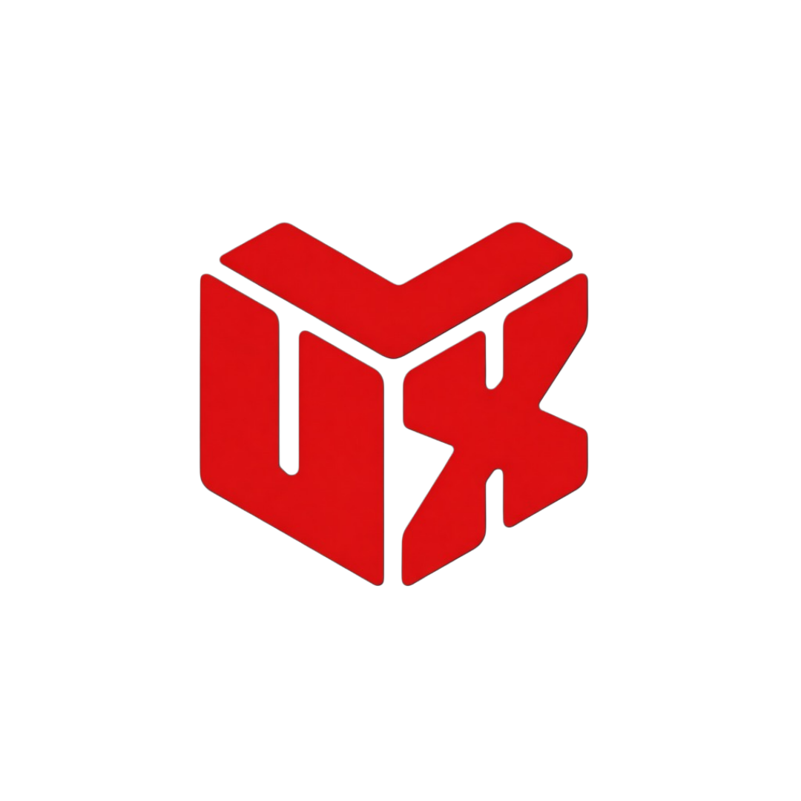

# Tensor Galileo | LumeFX Presets Store

<p align="center">
  
</p>

<p align="center">
  
  
  
  
</p>

A premium marketplace for high-quality video editing assets, including Cinematic LUTs, curated Sound Effects (SFX), and professional fonts. Built for creators who want to elevate their production value with ease.

---

## 🚀 Overview

Tensor Galileo (running on [lumefxpresets.store](https://lumefxpresets.store)) provides a seamless experience for browsing and purchasing editing bundles. The site features interactive showcases, smooth animations, and automated asset delivery upon purchase.

### 🎥 Asset Gallery

| Cinematic LUTs | Professional Bundles |
| :---: | :---: |
|  |  |
| *Visual Transformation Results* | *Curated Asset Bundles* |

---

## 🛠️ Tech Stack

### Frontend
- **Framework**: [Next.js 15+](https://nextjs.org/) (App Router)
- **UI & Animations**: React, [Three.js](https://threejs.org/) (Fiber/Drei), [GSAP](https://greensock.com/gsap/) for smooth transitions.
- **Styling**: Vanilla CSS with a focus on premium aesthetics and responsive design.

### Backend
- **Core**: [Flask](https://flask.palletsprojects.com/) (Python)
- **Database**: [Supabase](https://supabase.com/) (PostgreSQL)
- **Payment Gateway**: [Razorpay](https://razorpay.com/)
- **Email Service**: [Resend](https://resend.com/) for automated delivery of digital assets.

---

## 📂 Project Structure

```bash
tensor-galileo/
├── backend/            # Python Flask API
│   ├── routes/         # API Route Handlers (Checkout, Payment, Download)
│   ├── app.py          # Backend Entry Point
│   ├── requirements.txt
│   └── .env            # Backend Environment Variables
├── public/             # Static Assets (Images, Videos, Icons)
│   ├── before-after/   # LUT Comparison Previews
│   └── bundle/         # Product Asset Thumbnails
├── src/                # Next.js Frontend
│   ├── app/            # App Router Pages & Styles
│   ├── components/     # React Components (Hero, Modal, Sections)
│   └── lib/            # Shared Utilities
└── package.json        # Frontend Dependencies
```

---

## 📦 Key Features

- **✅ Interactive Asset Showcase**: High-fidelity previews of LUTs, SFX, and fonts.
- **✅ Before/After Comparisons**: Visual demonstrations of cinematic presets.
- **✅ Secure Checkout**: Integrated Razorpay modal for seamless payments.
- **✅ Automated Delivery**: Immediate email delivery of download links post-verification.
- **✅ Responsive Design**: Optimized for both desktop and mobile creators.

---

## ⚙️ Local Development

### Prerequisites
- Node.js (v18+)
- Python (v3.9+)
- Supabase account & project
- Razorpay & Resend API keys

### 1. Frontend Setup
```bash
# Install dependencies
npm install

# Setup environment variables
cp .env.local.example .env.local

# Run the development server
npm run dev
```

### 2. Backend Setup
```bash
cd backend
python -m venv venv
source venv/bin/activate  # On Windows: venv\Scripts\activate
pip install -r requirements.txt
cp .env.example .env
python app.py
```

## 🌐 Deployment

The project is configured for deployment on **Netlify**.
- Frontend: Managed via Next.js Netlify plugin.
- Backend: Can be deployed as Netlify Functions or external Flask hosting.

---
Built with ❤️ for the Creative Community.
